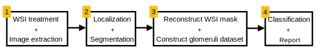

# Glomeruli segmentation in renal biopsy images using Machine Learning (TF/Keras)

## Introduction

SUMMARY

RESULTS IMAGES

## Environment Set-up

### Creating a Conda Environment

1. Install conda on your device: installation guide for
   [Windows](https://docs.conda.io/projects/conda/en/latest/user-guide/install/windows.html) |
   [Linux](https://docs.conda.io/projects/conda/en/latest/user-guide/install/linux.html)
   By default, conda creates the _base_ environment. You can deactivate it with `conda deactivate base`
2. Create a new environment specifying Python version.

```bash
username:~$ conda create --name your_env_name python=3.8
```

**NOTE:** Any Python3 version is valid. Nonetheless, 3.8 or higher is recommended.

3. Activate the new environment. When an environment is active, the name within brackets will appear before your
   username.

```bash
username:~$ conda activate your_env_name 
(your_env_name) username:~$ 
```

### Project requirements

4. Use `pip` to install the list of required modules. They are listed in the `requirements.txt` file included in the
   parent directory.

```bash
(your_env_name) username:~$ pip install -r /path/to/repo/requirements.txt
```

<h3 id="openslide"><a href=https://openslide.org/api/python/>OpenSlide for Python</a></h3>

#### Installation Steps

- **Windows**

1. Install OpenSlide API for Python:

```bash
username:~$ pip install openslide-python
```

2. Install [OpenSlide Source Binaries](https://openslide.org/download/), downloading the last version
   (**Windows Binaries** section). Unzip it in your desired directory. The folder structure can be seen below.

```bash
username:path-to-openslide-folder~$ tree 
├───bin/
│   ├───libopenslide-0.dll
│   └───...
├───include/
│   └───openslide/
├───lib/
└───licenses/
```

3. Create a new environment variable named `OPENSLIDE_PATH` that contains the path to the `bin/` directory. **This step
   is crucial**. You can follow this
   [guide](https://docs.oracle.com/en/database/oracle/machine-learning/oml4r/1.5.1/oread/creating-and-modifying-environment-variables-on-windows.html),
   or open a command prompt and type the following command (the `echo` command is just used to ensure that the variable has
   been succesfully saved):

```bash
C:/Users/user> setx OPENSLIDE_PATH "path/to/openslide/bin"
C:/Users/user> echo %OPENSLIDE_PATH%
```

4. Finally, you have to include the following code snippet in those files where you want to use OpenSlide:

```python
from sys import platform

_dll_path = os.getenv('OPENSLIDE_PATH')  
if _dll_path is not None:
    # Python >= 3.8
    with os.add_dll_directory(_dll_path):
        import openslide
```

- **Linux (Ubuntu)**

Install OpenSlide API for Python:

```bash
username:~$ pip install openslide-python
```

Install OpenSlide source:

```bash
username:~$ sudo apt-get install openslide-tools
```

Import OpenSlide to your Python script:

```python
import openslide
```

#### OpenSlide Guide

Check the [OpenSlide API documentation](https://openslide.org/api/python/) for Python.

[hello](#openslide)

## Project Structure

## Results

## Future work

## References

## Goals

- [ ]  Build a ML-based segmentation tool using [TF/Keras](https://www.tensorflow.org/overview) to find
  glomeruli in renal tissue [Whole-Slide Images](https://www.mbfbioscience.com/whole-slide-imaging) (WSI).
  At least,  a hit percentage of **95%** is required.
- [ ]  Develop a functional application for glomeruli classification from renal biopsy WSI. The final result
  might accepts as input a renal tissue WSI, and get as output the classification for the whole set of glomeruli
  contained in that image.
- [ ]  Compare different segmentation model architectures to extract conclusions about what works better for
  our case study: Classic U-Net [[1]](#1), [DoubleU-Net](https://arxiv.org/pdf/2006.04868.pdf), [U-Net++,](https://arxiv.org/pdf/1807.10165.pdf) belong others.

## Environment Setup

## Application stages

1. Renal tissue images use to have huge dimensions, being highly not recommended to directly process them. Cutting up
   these images into "patches" is an acceptable approach to reduce time and processing costs. We implement MATLAB
   OpenSlide library [[2]](#2) with this purpose, obtaining a set of _3200 x 3200 px_ images.
2. The obtained images can be employed to train a segmentation neural network architecture, as a U-Net, to find specific
   elements. In our case, the target are glomeruli (see Figure 1). As we are working with supervised learning, the model
   needs both the set of images and a ground-truth set of masks. This masks has been acquired manually.
3. Once the network has been trained and its weights is saved, the model will try to automatically find glomeruli in
   input images. Thinking about the last stage (classification), we have to build a dataset of glomeruli. Using the coordinates
   of each segmented glomerulus, a _600 x 600 px_ patch can be extracted for each of them.
4. The whole set of _600 x 600 px_ images will be fed to a multi-class classification network to detect whether a glomerulus
   has any disease or not.


Figure 2: Application stages

**NOTE:**  Stages 1 and 3 work with [OpenSlide](https://openslide.org/) to work with Whole-Slide Images. This library
is C-native, but there exists APIs for MATLAB and Python, for instance. See the section
[OpenSlide for Python](#openslide-for-python).

## Project structure

* `workflow.py`: main execution file. It is used to prepare, train and test de segmentation
  model for a set of configuration parameter values. Output files are saved to the _output/_ directory,
  in a specific folder named with the execution date and time.
* `dataset.py`: defines classes to easily treat data.
* `dataGenerator.py`: include classes defining
  [Keras Sequential Generators](https://www.tensorflow.org/api_docs/python/tf/keras/utils/Sequence) to iteratively feed
  data to the network model. When you are working with huge amounts of data (specially, when this data are images), it is
  not a good practice to load the whole dataset in RAM for training. Look into the Keras documentation for Keras
  [model.fit()](https://www.tensorflow.org/api_docs/python/tf/keras/Model#fit) method to understand how to use
  generators for training. Check also this useful [tutorial](https://stanford.edu/~shervine/blog/keras-how-to-generate-data-on-the-fly).
* `unet_model.py`: segmentation model, obtained from [[1]](#1). It implements a basic U-Net architecture,
  typically used for segmentation tasks, including medical contexts.
* `mask_generator/`: folder containing files with functionalities for generating or loading masks.

  * `MaskGenerator.py`: This class is used to create or load masks. Three types or
    masks have been tested: _Handcrafted_ (see Figure 2) or _synthetic_ masks.
  * `manual_masks.py`: includes functionalities that were useful for the handcrafted masks generation,
    as marking the coordinates where a glomerulus can be found, or border filling, so just using a renal
    tissue patch where the glomeruli borders are marked with green color, a binary mask is automatically
    generated.


Figure 2: Obtaining handcrafted masks. The first step was to remark the limits of each glomerulus with an easily
perceptible color. Next, using the `manual_masks.py` script, binary masks are obtained.

* `utils.py`: includes general purpose functions.
* `parameters.py`: Set of parameters to modify during the model testing:

  - `DATASET_PATH`: directory where the dataset can be founded in disk (*).
  - `PATCH_SIZE`: by default, (3200, 3200)
  - `UNET_INPUT_SIZE`: by default, (256, 256)
  - `RESIZE_RATIO`: Input images are parititoned into sub-patches. To avoid using directly the
    input dimension, a resize ratio is stablished.
  - `STAINING`: Image we are using can be classified by different stainings used for the renal tissues:
    HE, PAS or PM. This parameter varies the staining used for the model training. Allowed values: 'HE' ,'PAS', 'PM', 'ALL'

_Model parameters_

- LEARNING_RATE
- MONITORED_METRIC: see [Keras metrics](https://keras.io/api/metrics/) and select your preferred one. For segmentation tasks, IoU has been proved
  to be the most indicated

_Mask Generator_

- MASK_TYPE: uses the MaskType Enum class to select from three possible types: HANDCRADTED, CIRCULAR, BBOX
- MASK_SIZE: when synthetic circular masks are created, you need to specify a desired radius for each
  glomeruli mask. If None, this parameter tells that the radius will vary based on the glomerulus class specified
  at the corresponding xml file.
- APPLY_SIMPLEX: [Simplex algorithm](https://www.sciencedirect.com/topics/computer-science/simplex-algorithm#:~:text=The%20simplex%20algorithm%2C%20developed%20by,that%20satisfies%20all%20the%20constraints.) can be used to delimit the radius of a set of circles contained in
  the same image so no one will ve overlapped.

_Training parameters and hyper-parameters_

- TRAINVAL_TEST_SPLIT_RATE
- TRAIN_SIZE
- TRAINVAL_TEST_RAND_STATE: [train_test_split sklearn method](https://scikit-learn.org/stable/modules/generated/sklearn.model_selection.train_test_split.html)
  uses shuffle to modify the input data order. Specifiyng a random state lets the programmer to maintain the same random order for
  every test, so it is easier to understand the results obtained.
- TRAIN_VAL_RAND_STATE
- MIN_LEARNING_RATE: just used when ReduceLROnPleteau Keras callback is used.
- PREDICTION_THRESHOLD: The U-Net model generates a binary-map with values [0..1] indicating with
  the highest values where the desired object can be found. This prediction threshold is used to obtain
  a binary mask directly from this bit map.
- BATCH_SIZE
- EPOCHS

_Model callbacks_

- ES_PATIENCE: Early Stopping epochs patience
- REDUCELR_PATIENCE: ReduceLROnPlateau epochs patience
- ACTIVATE_REDUCELR: Activate [ReduceLROnPlateau](https://keras.io/api/callbacks/reduce_lr_on_plateau/) callback function

_(*) The dataset path should strictly maintain the following directory tree:_

_gt/ - Every time a new mask type or mask configurations are used, a new subdirectory
will be generated inside this directory, containing the groundtruth masks._

_ims/ - Total set of renal tissue patches._

_xml/ - Total set of xml files related to the renal tissue patches. This xml files
contain information about the exact position and class of most glomeruli._

_train_val/ - The segmentation model just works for an specific input size.
Images and masks will be partitioned into sub-patches, and this sub-patches
will be saved into this directory._

## References

<a id="1">[1]</a>
Bhattiprolu, Sreenivas.
Python for microscopists ([GitHub repository](https://github.com/bnsreenu/python_for_microscopists))

<a id="2">[2]</a>
Daniel Forsberg (2022).
fordanic/openslide-matlab,
([GitHub](https://github.com/fordanic/openslide-matlab)). Retrieved February 1, 2022.

- [Source dataset](https://www.epfl.ch/labs/cvlab/data/data-em/)
