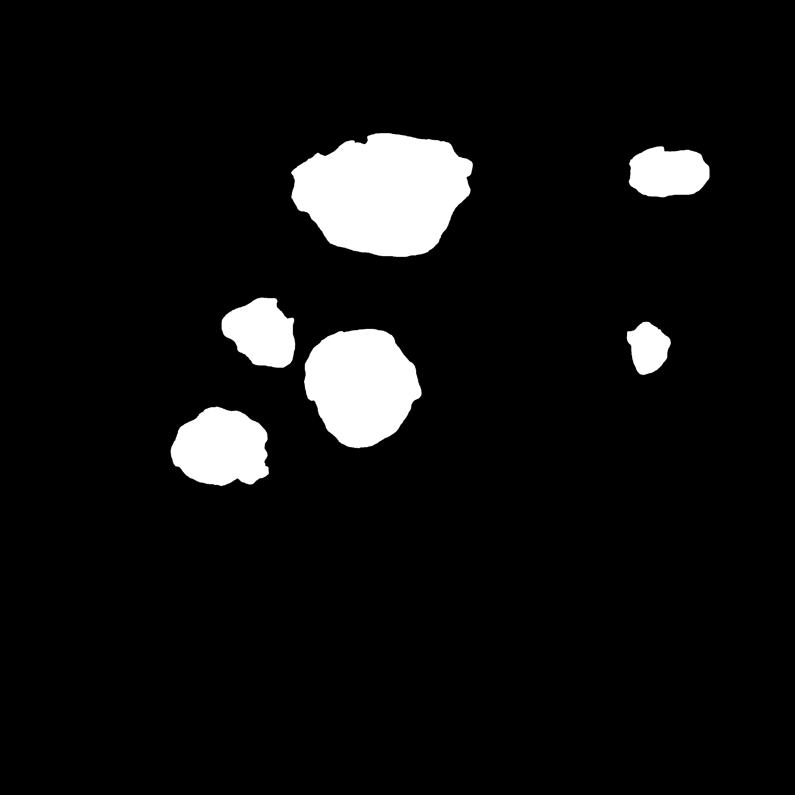
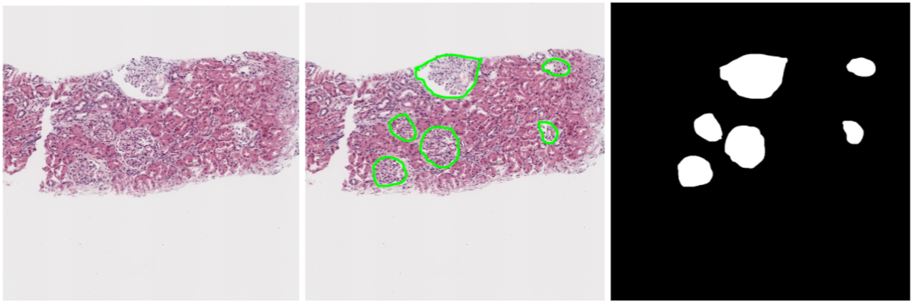

# Renal Biopsy segmentation using Artificial Intelligence

Image             |  Mask
:-------------------------:|:-------------------------:
  |  

## Goals

1. Build a functional segmentation tool using Artificial intelligence (with Tensorflow and Keras)
that can detect at least **95%** glomeruli that can be found in renal biopsy images.
2. Compare different segmentation models to extract conclusions about what works better for 
our case study.

## Project structure

---
* **testbench.py**: main execution file. It is used to prepare, train and test de segmentation 
model for a set of configuration parameter values 

* **dataset.py**: defines a class used to prepare images and load or generate the 
groundtruth (masks) needed to train the segmentation model. 

* **unet_model.py**: segmentation model. It implements a basic U-Net architecture,
typically used for segmentation tasks, including medical contexts.  

* **mask_generator/** folder: files with functionalities for generating or loading masks.
  * **MaskGenerator.py**: This class is used to create or load masks. Three types or
    masks have been tested: Handcrafted or synthetic masks.
    - Synthetic: using previously labelled medical images, it's possible to 
    obtain information about the 
    - Handcrafted: This masks has been obtained manually directly from painting the
    set of medical images we has been used to train our model.
  
  * **manual_masks.py**: includes functionalities that were useful for the handcrafted masks generation,
  as marking the coordinates where a glomerulus can be found, or border filling, so just using a renal
  tissue patch where the glomeruli borders are marked with green color, a binary mask is automatically
  generated.

* **utils.py**: this file gather a set of less important functionalities used to ease the code reading and understanding. 

* **parameters.py**: Set of parameters to modify during the model testing.

_General model aspects_

- DATASET_PATH: directory where the dataset can be founded in disk (*).
- PATCH_SIZE: by default, (3200, 3200)
- UNET_INPUT_SIZE: by default, (256, 256)
- RESIZE_RATIO: Input images are parititoned into sub-patches. To avoid using directly the
input dimension, a resize ratio is stablished.
- STAINING: Image we are using can be classified by different stainings used for the renal tissues:
HE, PAS or PM. This parameter varies the staining used for the model training. Allowed values: 'HE' ,'PAS', 'PM', 'ALL'
  
_Model parameters_

- LEARNING_RATE
- MONITORED_METRIC: see [Keras metrics](https://keras.io/api/metrics/) and select your preferred one. For segmentation tasks, IoU has been proved
 to be the most indicated

_Mask Generator_

- MASK_TYPE: uses the MaskType Enum class to select from three possible types: HANDCRADTED, CIRCULAR, BBOX
- MASK_SIZE: when synthetic circular masks are created, you need to specify a desired radius for each
glomeruli mask. If None, this parameter tells that the radius will vary based on the glomerulus class specified 
at the corresponding xml file.
- APPLY_SIMPLEX: [Simplex algorithm](https://www.sciencedirect.com/topics/computer-science/simplex-algorithm#:~:text=The%20simplex%20algorithm%2C%20developed%20by,that%20satisfies%20all%20the%20constraints.) can be used to delimit the radius of a set of circles contained in 
the same image so no one will ve overlapped. 

_Training parameters and hyper-parameters_

- TRAINVAL_TEST_SPLIT_RATE
- TRAIN_SIZE
- TRAINVAL_TEST_RAND_STATE: [train_test_split sklearn method](https://scikit-learn.org/stable/modules/generated/sklearn.model_selection.train_test_split.html)
  uses shuffle to modify the input data order. Specifiyng a random state lets the programmer to maintain the same random order for
  every test, so it is easier to understand the results obtained.
- TRAIN_VAL_RAND_STATE
- MIN_LEARNING_RATE: just used when ReduceLROnPleteau Keras callback is used.
- PREDICTION_THRESHOLD: The U-Net model generates a binary-map with values [0..1] indicating with
the highest values where the desired object can be found. This prediction threshold is used to obtain
a binary mask directly from this bit map.
- BATCH_SIZE
- EPOCHS

_Model callbacks_

- ES_PATIENCE: Early Stopping epochs patience
- REDUCELR_PATIENCE: ReduceLROnPlateau epochs patience
- ACTIVATE_REDUCELR: Activate [ReduceLROnPlateau](https://keras.io/api/callbacks/reduce_lr_on_plateau/) callback function

_(*) The dataset path should strictly maintain the following directory tree:_

_gt/ - Every time a new mask type or mask configurations are used, a new subdirectory
will be generated inside this directory, containing the groundtruth masks._

_ims/ - Total set of renal tissue patches._

_xml/ - Total set of xml files related to the renal tissue patches. This xml files 
contain information about the exact position and class of most glomeruli._

_train_val/ - The segmentation model just works for an specific input size.
Images and masks will be partitioned into sub-patches, and this sub-patches 
will be saved into this directory._

## Sources

---
- [U-Net model source](https://www.youtube.com/watch?v=csFGTLT6_WQ&ab_channel=DigitalSreeni)
- [Source dataset](https://www.epfl.ch/labs/cvlab/data/data-em/)
 

